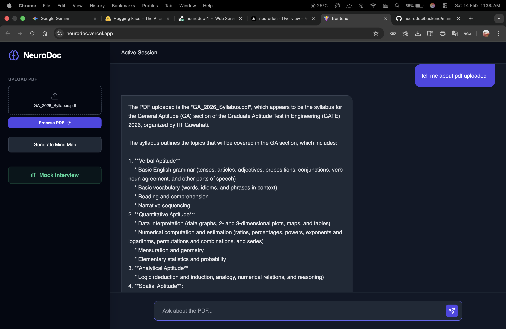
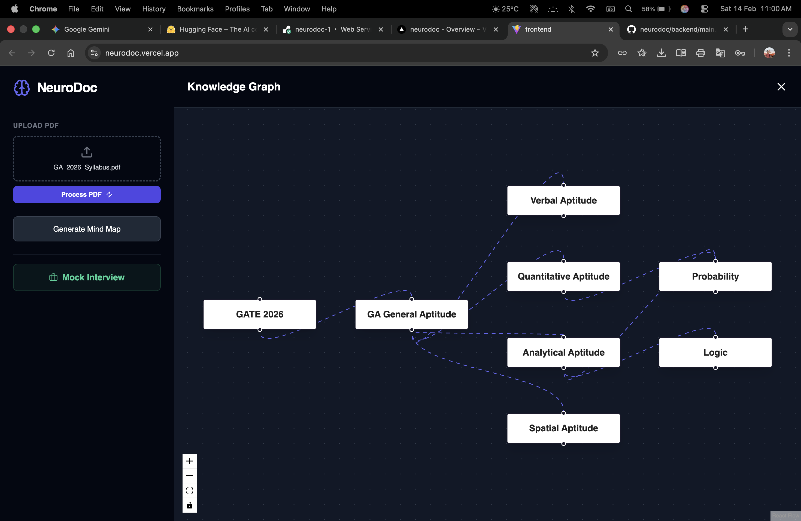
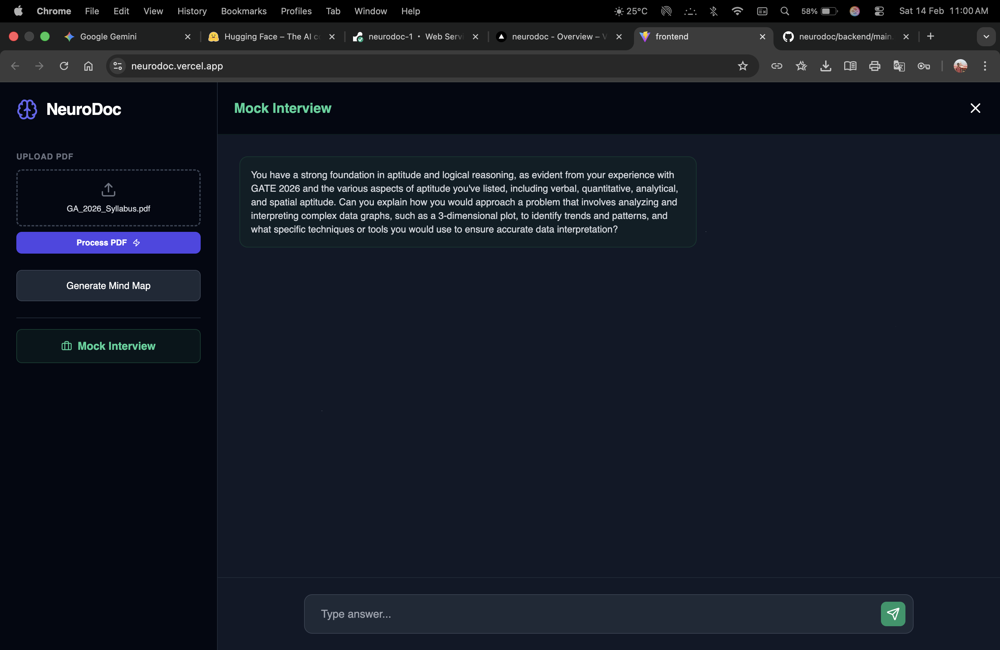

# 🧠 NeuroDoc: AI-Powered Document Assistant & Interview Coach

<div align="center">

[](https://neurodoc.vercel.app)
[](https://neurodoc-1.onrender.com)

**Interact with documents, generate visual learning aids, and prepare for technical job interviews.**

[Report Bug](https://github.com/your-username/neurodoc/issues) · [Request Feature](https://github.com/your-username/neurodoc/issues)

</div>

---

## 📸 Project Gallery

*(Upload your screenshots to the repository and ensure the filenames match below)*

| **📄 Chat with PDF (RAG)** | **🗺️ Automated Mind Maps** |
|:---:|:---:|
|  |  |
| *Context-aware answers from your PDF* | *Visualizing complex concepts instantly* |

| **👨‍💻 AI Mock Interviewer** | **🧠 Interview Feedback** |
|:---:|:---:|
|  |  |
| *Real-time technical questioning* | *Instant evaluation of your answers* |

---

## 🚀 Key Functionality

**NeuroDoc** is a full-stack Artificial Intelligence application designed to help users interact with documents, generate visual learning aids, and prepare for technical job interviews.

It leverages **Retrieval-Augmented Generation (RAG)** to "memorize" uploaded PDFs and uses **Llama-3 (via Groq)** for high-speed, intelligent conversations.

### 1. 📄 Chat with PDF (RAG System)
- **Function:** Upload any PDF (resumes, textbooks, papers).
- **Technology:** The app splits the document into chunks, converts them into vector embeddings using **HuggingFace**, and stores them in a **FAISS** vector database.
- **Usage:** You can ask specific questions about the document, and the AI will answer based *only* on the file's content.

### 2. 👨‍💻 AI Mock Interviewer
- **Function:** Simulates a Senior Technical Recruiter.
- **Logic:** It scans your uploaded resume, identifies your skills/projects, and generates a context-aware technical question. It then evaluates your answer and asks follow-up questions.
- **Endpoint:** `/interview/start` and `/interview/chat`.

### 3. 🕸️ Automated Mind Maps
- **Function:** Converts complex document topics into structured JSON data.
- **Usage:** Used by the frontend to render visual mind maps (nodes and edges) for easier studying.

### 4. 🧠 Memory & Web Search
- **Memory:** Uses **SQLite** to store conversation history, allowing the AI to remember previous turns in the chat.
- **Web Search:** Integrated **DuckDuckGo** search to fetch live information (e.g., "latest news," "current stock price") when the answer isn't in the PDF.

---

## 🛠️ Tech Stack & Libraries

**Backend (Python & FastAPI):**
* `fastapi`: High-performance web framework for the API.
* `uvicorn`: ASGI server to run the application.
* `sqlite3`: Embedded database for chat history.

**AI & Machine Learning:**
* `langchain-groq`: Connects to Groq's Llama-3 model for ultra-fast inference.
* `langchain-huggingface`: Uses `HuggingFaceEndpointEmbeddings` for text-to-vector conversion.
* `faiss-cpu`: Facebook AI Similarity Search for efficient vector storage.
* `pypdf`: For parsing and reading uploaded PDF files.

**Tools:**
* `duckduckgo-search`: For real-time web browsing capabilities.

---

## 🔑 API Keys & Secrets (Save for Later)

**⚠️ KEEP PRIVATE:** These are the keys required to run the project.

| Service | Variable Name | Value (Your Keys) |
| :--- | :--- | :--- |
| **Groq Cloud** | `GROQ_API_KEY` | `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` |
| **Hugging Face** | `HUGGINGFACE_API_KEY` | *(Paste your hf_... token here)* |

*(Note: The Groq key above was retrieved from your source code.)*

---

## 💻 Local Installation & Setup

If you need to run this on a new computer in the future, follow these steps:

### 1. Clone & Install
```bash
# Clone repository
git clone <your-repo-url>
cd neurodoc/backend

# Create virtual environment
python -m venv venv
source venv/bin/activate  # (Windows: venv\Scripts\activate)

# Install dependencies
pip install -r requirements.txt
