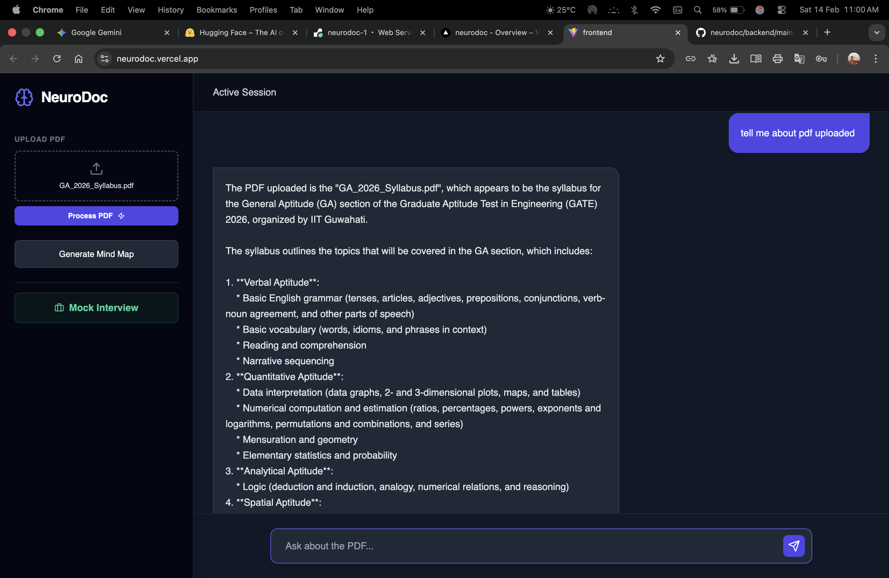
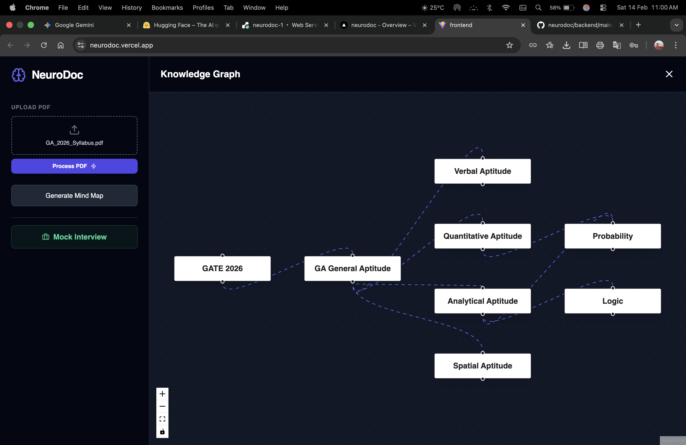
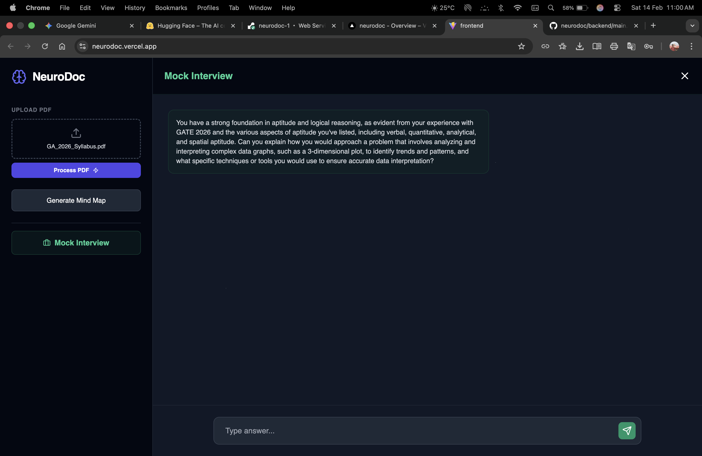
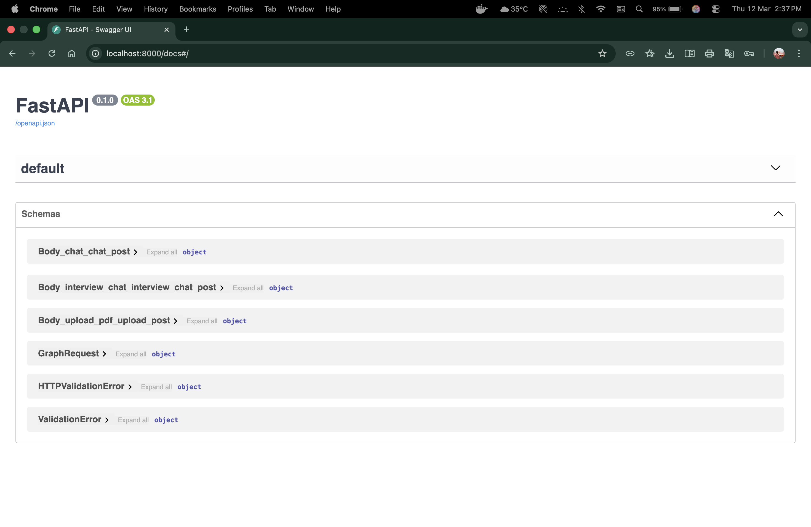

# 🧠 NeuroDoc: AI-Powered Document Assistant & Interview Coach

<div align="center">

[](https://neurodoc.vercel.app)
[](https://neurodoc-1.onrender.com)
[](https://www.docker.com/)
[](https://fastapi.tiangolo.com/)

**Interact with documents, generate visual learning aids, and prepare for technical job interviews — all powered by Llama-3 AI.**

[Report Bug](https://github.com/Tansukh18/neurodoc/issues) · [Request Feature](https://github.com/Tansukh18/neurodoc/issues)

</div>

---

## 📸 Project Gallery

| **📄 Chat with PDF (RAG)** | **🗺️ Automated Mind Maps** |
|:---:|:---:|
|  |  |

| **👨‍💻 AI Mock Interviewer** | **🐳 Docker Deployment** |
|:---:|:---:|
|  |  |

---

## 🚀 Key Features

**NeuroDoc** is a full-stack AI application that lets users interact with documents,
generate visual mind maps, and prepare for technical interviews using RAG + Llama-3.

### 📄 Chat with PDF (RAG Pipeline)
- Upload any PDF — resume, textbook, research paper
- Document is chunked, embedded using HuggingFace, and stored in FAISS vector database
- Ask questions and get citation-backed answers from the document content only

### 👨‍💻 AI Mock Interviewer
- Scans your uploaded resume and identifies your skills and projects
- Generates context-aware technical interview questions
- Evaluates your answers and asks intelligent follow-up questions

### 🕸️ Automated Mind Maps
- Converts complex document topics into structured visual mind maps
- Renders interactive nodes and edges for easier studying

### 🧠 Persistent Memory + Web Search
- SQLite database stores full conversation history across sessions
- DuckDuckGo integration fetches live web data when answer is not in PDF

---

## 🛠️ Tech Stack

| Layer | Technology |
|---|---|
| **Frontend** | React 19, Vite, TailwindCSS, ReactFlow, Framer Motion |
| **Backend** | Python, FastAPI, Uvicorn |
| **AI / LLM** | Groq Llama-3.3-70b, LangChain, HuggingFace Embeddings |
| **Vector DB** | FAISS (Facebook AI Similarity Search) |
| **Memory** | SQLite |
| **Web Search** | DuckDuckGo Search |
| **Deployment** | Docker, docker-compose, Vercel, Render |

---

## 🐳 Run with Docker (Recommended)

No need to install Python or any dependencies manually.
Docker handles everything in one command.

### Prerequisites
- [Docker Desktop](https://www.docker.com/products/docker-desktop/) installed and running

### Steps
```bash
# Clone the repository
git clone https://github.com/Tansukh18/neurodoc.git
cd neurodoc/backend

# Create your .env file
cp .env.example .env
# Open .env and add your API keys

# Build and run with Docker
docker-compose up --build
```

Open your browser and go to:
```
http://localhost:8000/docs
```

You will see the full FastAPI documentation page with all endpoints ready to test.

### Stop the container
```bash
docker-compose down
```

---

## 💻 Run Locally Without Docker
```bash
# Clone repository
git clone https://github.com/Tansukh18/neurodoc.git
cd neurodoc/backend

# Create virtual environment
python -m venv venv
source venv/bin/activate

# Install dependencies
pip install -r requirements.txt

# Add your API keys
cp .env.example .env

# Run the server
uvicorn main:app --reload
```

---

## 🔑 Environment Variables

Create a `.env` file in the backend folder with these keys:
```
GROQ_API_KEY=your_groq_api_key_here
HUGGINGFACE_API_KEY=your_huggingface_key_here
```

Get your free keys here:
- Groq API key → [https://console.groq.com/keys](https://console.groq.com/keys)
- HuggingFace token → [https://huggingface.co/settings/tokens](https://huggingface.co/settings/tokens)

---

## 📡 API Endpoints

| Method | Endpoint | Description |
|---|---|---|
| GET | `/` | Health check |
| POST | `/upload` | Upload PDF and create vector store |
| POST | `/chat` | Chat with the document |
| POST | `/mindmap` | Generate mind map JSON |
| POST | `/interview/start` | Start mock interview session |
| POST | `/interview/chat` | Continue interview conversation |

---

## 🔗 Live Deployment

| Service | URL |
|---|---|
| 🔴 Frontend (Vercel) | [neurodoc.vercel.app](https://neurodoc.vercel.app) |
| ⚡ Backend (Render) | [neurodoc-1.onrender.com](https://neurodoc-1.onrender.com) |
